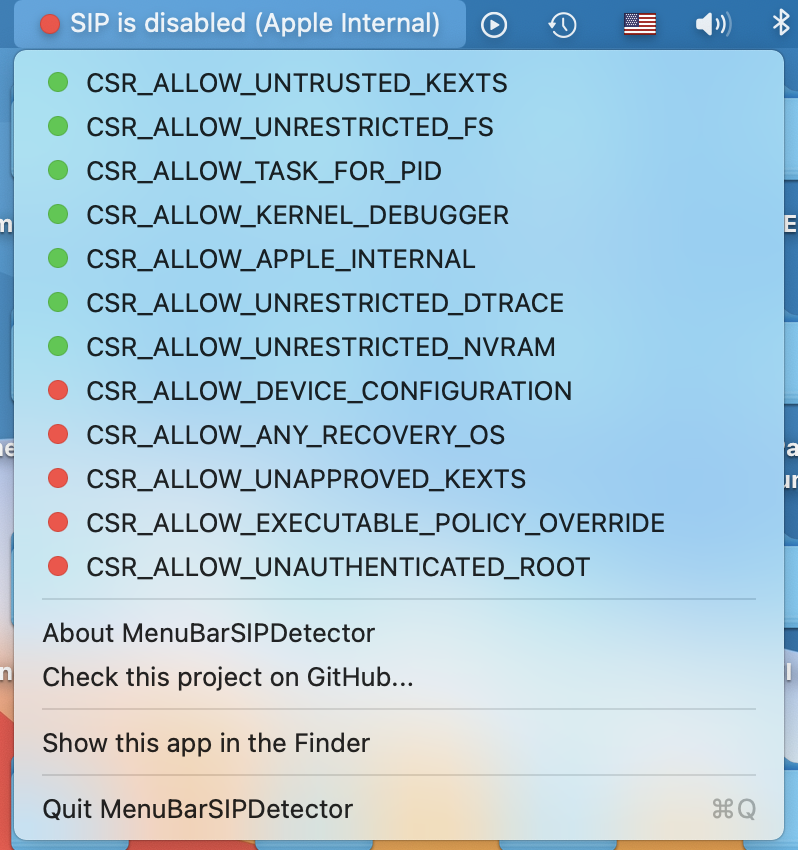

# MenuBarSIPDetector

This is a DEMO app for my Swift library  [TINURecovery](https://github.com/ITzTravelInTime/TINURecovery) and it is a macOS menu bar app that displays the current status of SIP (System Integrity Protection).

This app has been mostly made for Developers and people who often changes the status of SIP and want to always know what is it's current value.

# Credits

 - ITzTravelInTime (Pietro Caruso) - Project creator and main developer

# Contacts

 - ITzTravelInTime (Pietro Caruso): piecaruso97@gmail.com

# Copyright

Copyright (C) 2021 Pietro Caruso

This library is free software; you can redistribute it and/or modify it under the terms of the GNU Lesser General Public License as published by the Free Software Foundation; either version 2.1 of the License, or (at your option) any later version.

This library is distributed in the hope that it will be useful, but WITHOUT ANY WARRANTY; without even the implied warranty of MERCHANTABILITY or FITNESS FOR A PARTICULAR PURPOSE. See the GNU Lesser General Public License for more details.

You should have received a copy of the GNU Lesser General Public License along with this library; if not, write to the Free Software Foundation, Inc., 59 Temple Place, Suite 330, Boston, MA 02111-1307 USA

