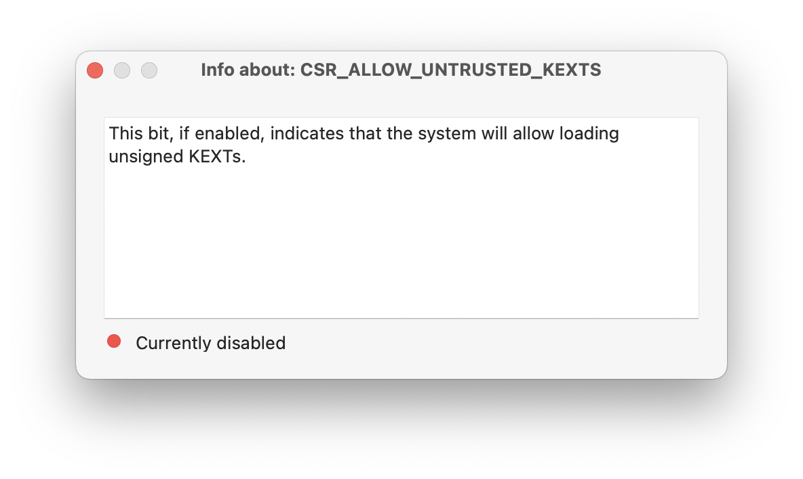

# MenuBarSIPDetector

This is a DEMO app for my Swift library  [TINURecovery](https://github.com/ITzTravelInTime/TINURecovery) and it is a macOS menu bar app that displays the current status of SIP (System Integrity Protection) including all the details.

This app has been mostly made for Developers and people who often changes the status of SIP and want to always know what is it's current value precisely.

# Credits

 - ITzTravelInTime (Pietro Caruso) - Project creator and main developer

# Contacts

 - ITzTravelInTime (Pietro Caruso): piecaruso97@gmail.com

# Legal info

MenuBarSIPDetector: A simple app to know the current status of the System Integrity Protection.
Copyright (C) 2021 Pietro Caruso (ITzTravelInTime)

This program is free software; you can redistribute it and/or modify
it under the terms of the GNU General Public License as published by
the Free Software Foundation; either version 2 of the License, or
(at your option) any later version.

This program is distributed in the hope that it will be useful,
but WITHOUT ANY WARRANTY; without even the implied warranty of
MERCHANTABILITY or FITNESS FOR A PARTICULAR PURPOSE.  See the
GNU General Public License for more details.

You should have received a copy of the GNU General Public License along
with this program; if not, write to the Free Software Foundation, Inc.,
51 Franklin Street, Fifth Floor, Boston, MA 02110-1301 USA.

