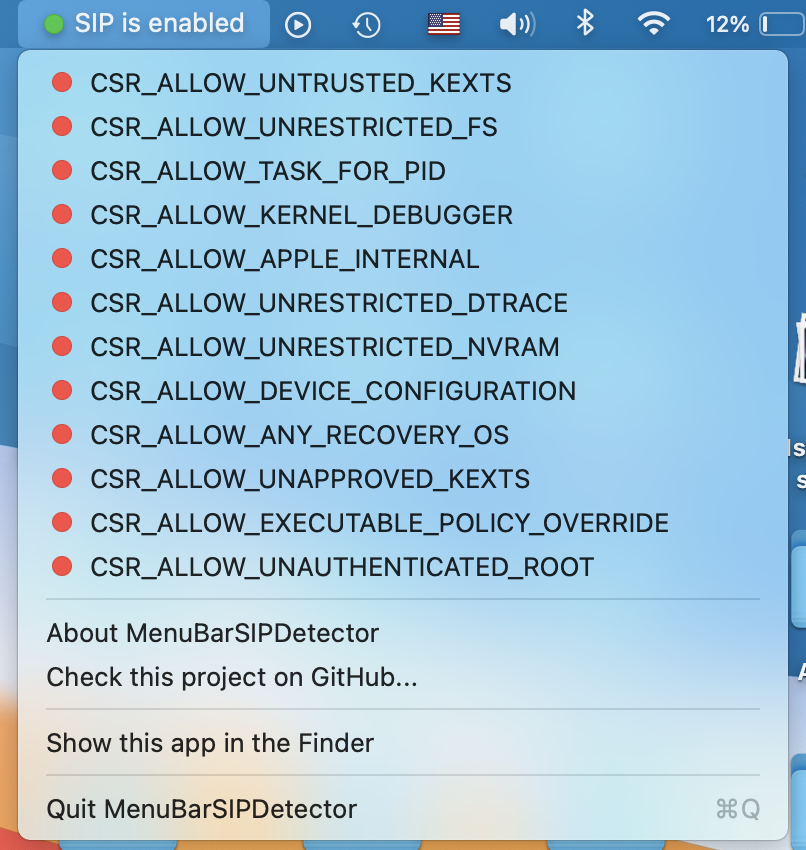

# MenuBarSIPDetector

This is a DEMO app for my Swift library called [TINURecovery](https://github.com/ITzTravelInTime/TINURecovery) and it is a macOS menu bar app that displays the current status of SIP (System Integrity Protection).

This app has been mostly made for Developers and people who often changes the status of SIP and want to always know what is it's current value.

# Credits

ITzTravelInTime (aka Pietro Caruso) for library and app development.

